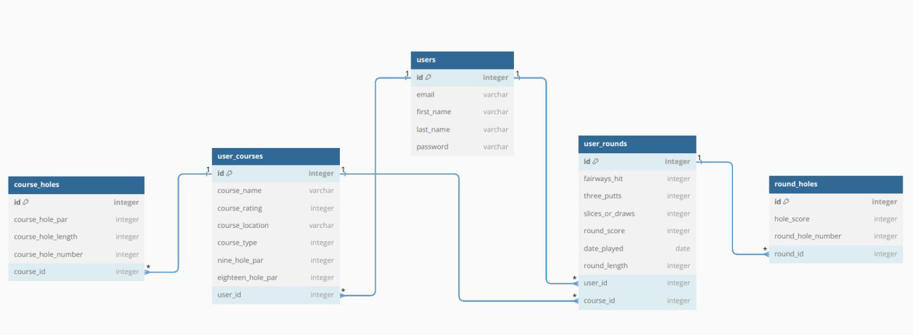
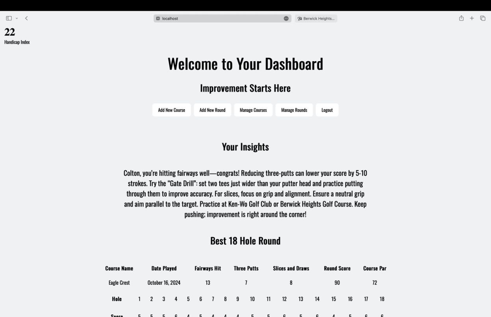
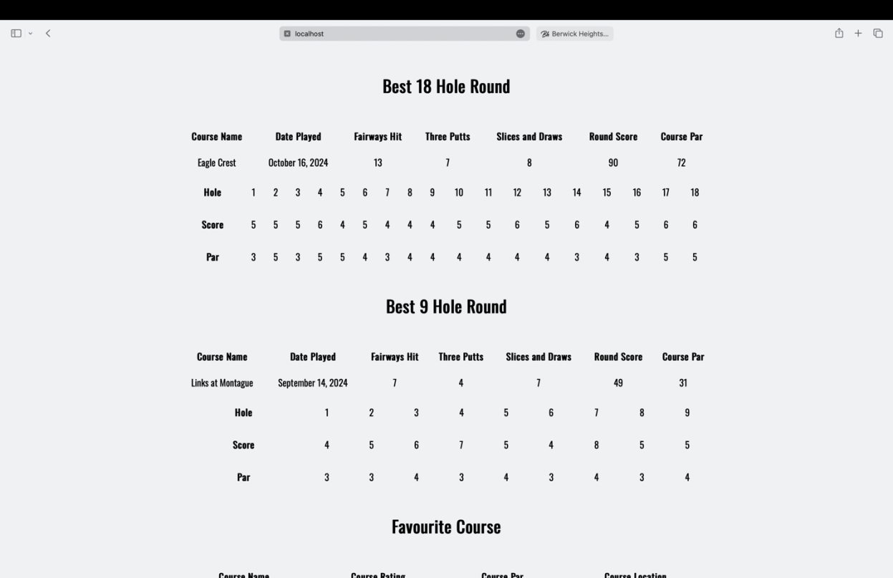
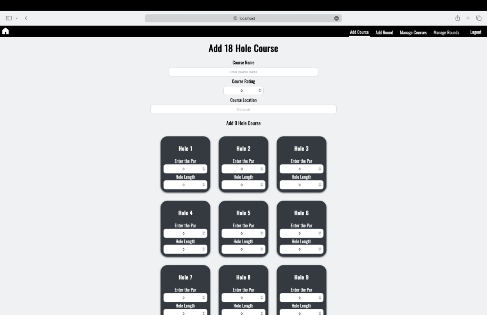
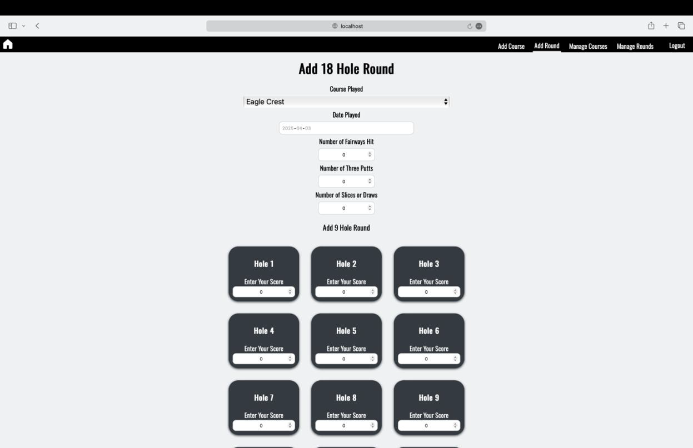
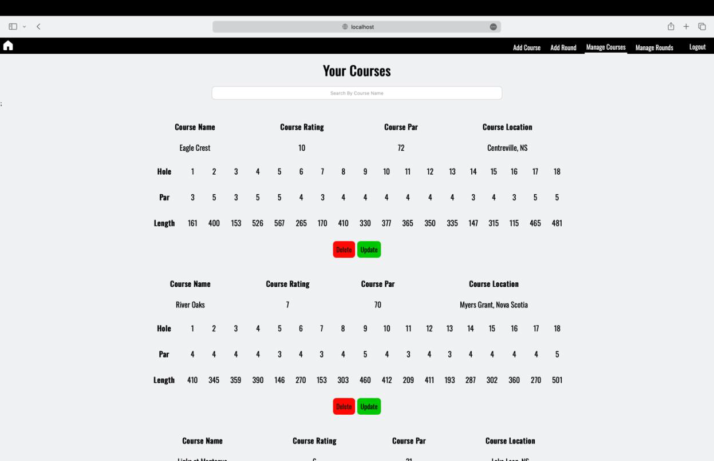

# Golf AI Insights and Management Web Application

## Description

The main objective of this project was to develop an AI-powered web application to provide personalized insights and feedback. The main dashboard provides feedback on drills to improve areas like three-putting and slices, how much your score could lower if you improve these areas, and golf courses near you. Users can add courses and rounds at those courses to get not only insights but their best rounds, favourite course, most played course, and handicap index. They can then navigate to a page that displays all their courses then another that displays all rounds. Here they can delete or update any course or round. This is an important feature especially for the courses as sometimes a par or length of a hole will change. The project was developed using React, Java Spring Boot, PostgreSQL, and the OpenAI API to provide the insights on the users last five rounds. The result provides users with all the above in a way that is simple to use and navigate and has clean UI.

## Hardware and Software Requirements

To run this application for yourself you need is JDK 21 installed, Node.JS, an IDE preferably IntelliJ for the back end and VS code for the front end, and a PostgreSQL database that runs locally on your machine. As well as an Open AI API key.

## Instalation Instructions

Copy the code from the GitHub repository into your favourite IDE. To setup the frontend run npm run build followed by npm run dev. In the applications.properties file in the backend is where the OpenAI API key go and the database is setup. To run run the backend run the main file which is called GolfManagementApplication.java (some dependencies may need to install first. Which are located in the pom.xml file). This application does require a database which could be any of your choosing. I used PostgreSQL but it could be swapped out with any other. An example of the database structure is below.

## Database Structure

## Final Product

